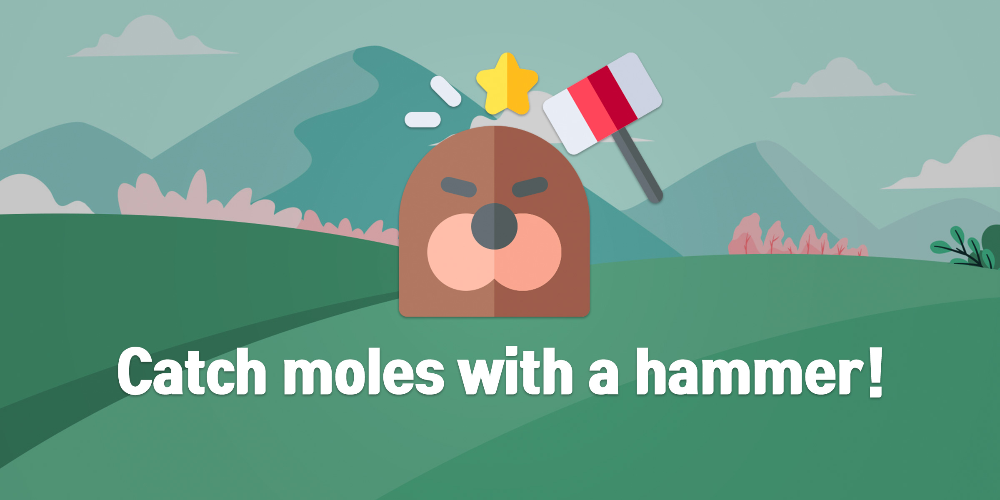
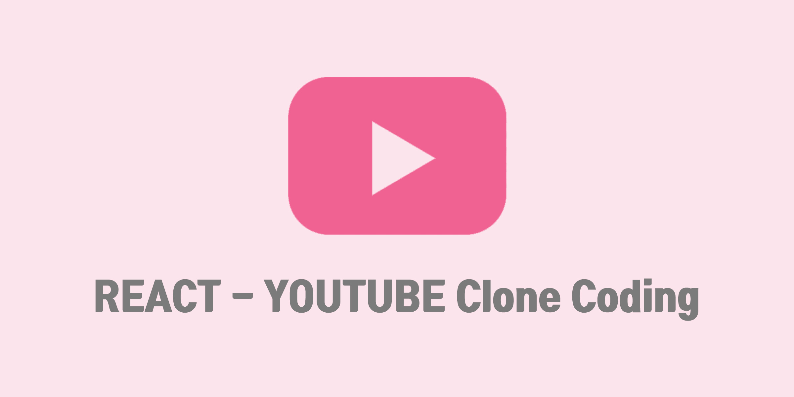
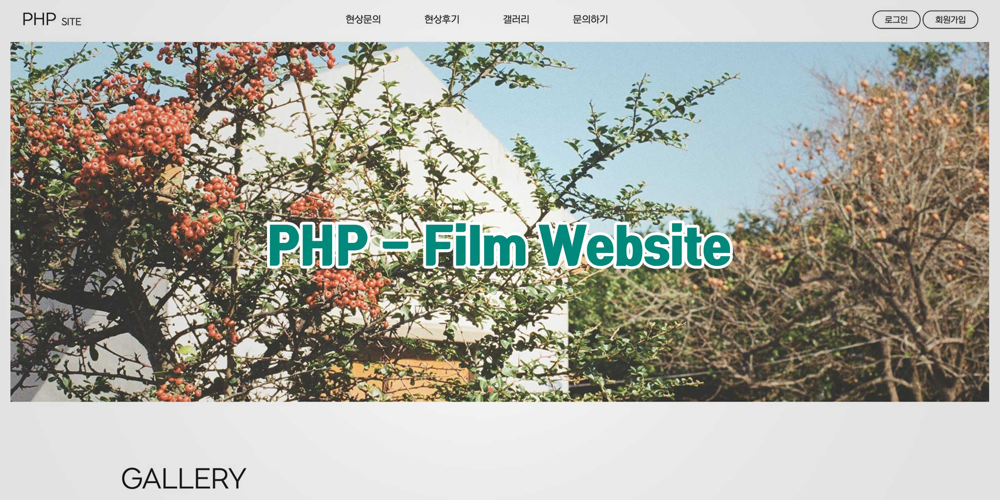

  <h1>Hi! I'm Hailie Park.  Welcome! to my page.</h1>

 

<h2>📚 Study Note</h2>
<ul>
  <li><a href="https://hailie1230.github.io/diary/" title="html css note">HTML & CSS</a></li>
  <li><a href="https://www.notion.so/JS-note-b48d49fd897f4f44a6d086f79dfd27a7" title="JAVASCRIPT Note">JAVASCRIPT</a></li>
  <li><a href="https://www.notion.so/React-Note-fbb2c7e247654d2cb090c9cbf0906857" title="REACT Note">REACT</a></li>
  <li><a href="https://www.notion.so/PHP-dc2586ac3ce44253a7b4445290dbf457" title="PHP Note">PHP</a></li>
</ul>

 
<h2>💪🏻 My Skills</h2>

 
<h2>👩🏻‍💻 My Projects</h2>

<table>
  <tbody>
    <tr>
      <td>
        
      </td>
      <td>
        
      </td>
      <td>
        
      </td>
    </tr>
    <tr>
      <td>
        Catching moles game
      </td>
      <td>
        Youtube Clone Coding
      </td>
      <td>
        PHP Website
      </td>
    </tr>
  </tbody>
</table>
<b><em><a href="https://hailie1230.github.io/portfolio/">More projects...</a></em></b>

